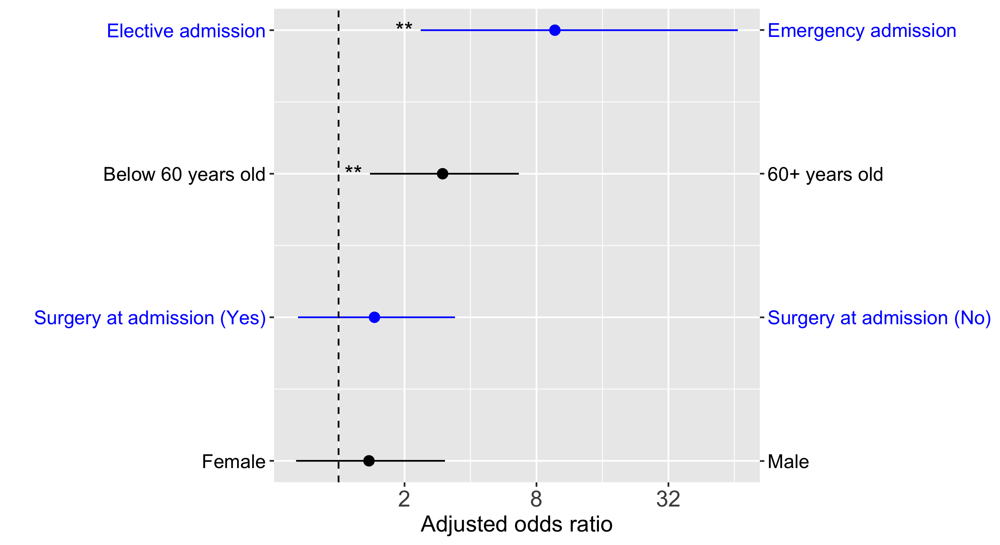

# Forest plot of odds ratios
Have you done a multivariate logistic regression using R?

Are your predictor variables dichotomous?

Then you can use ```forest_odds.R``` to directly output a figure like this:


This is a [forest plot](https://en.wikipedia.org/wiki/Forest_plot) of odds ratios with their confidence intervals.

But using ```forest_odds.R``` has a number of benefits:
- This R function does most of the work for you
- Automatically order odds ratios so that the most important factors are shown highest in the plot
- Automatically flip odds ratios, CIs and labels, so that odds ratios are all > 1
- Figure includes a pair of labels for the levels of each factor
- Figure elements alternate in colour across factors for easy visualization
- Options for font sizes and so on, if you want to change anything

# Prerequisites
- ggplot2

# How do I use this quickly?
Look at the script ```example_script.R```. It is a full example that includes doing a multivariate logistic regression in R.

# Can you write about how I should use this?
Here I describe the essential parts of the example script, ```example_script.R```.

After you call ```glm()``` in R like this for example:
```
output <- glm(sta ~ sex + ser + age + typ, data=icu3.dat, family=binomial)
```
`output` will be one of the inputs to ```forest_odds.R```.

Obviously, you'll need to specify the file name for your new figure.

However, you will also need to make 2 more variables to get going. All other inputs to ```forest_odds.R``` are optional, having to do with the appearance of the figure.

For the example figure shown above, you need to write something like this:
```
lowLab <- c("Male", "Surgery at admission (No)", "Below 60 years old", "Elective admission")
highLab <- c("Female", "Surgery at admission (Yes)", "60+ years old", "Emergency admission")
```
Please make sure that these labels match how your factors are coded. For example, the reference level for the `SEX` factor should be `Male`.

Also, make sure that the order of labels in `lowLab` and `highLab` match the order of the predictor variables in your call to `glm` when you actually asked R to do the regression. For example `SEX` is the first predictor in `output <- glm(sta ~ sex + ser + age + typ, data=icu3.dat, family=binomial)` and it is also the first predictor in both `lowLab` and `highLab`.

Finally, just write a single line of code to call ```forest_odds.R``` like this:
```
forest_odds(output, lowLab, highLab, "my-figure.png")
```
After you run your script, you'll get a new file with your figure in it.

# Source of data for the example script?
UCLA's Institute for Digital Research and Education makes available [various textbook datasets](https://stats.idre.ucla.edu/other/examples/). The particular dataset we use is from a commonly used textbook on logistic regression: Applied Logistic Regression (Second Edition) by David Hosmer and Stanley Lemeshow.

# Citation
If you use this R function to produce a figure that is published, please cite the following paper: **NEED TO FILL THIS IN LATER**
